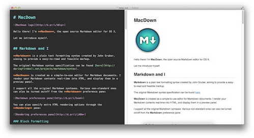

#Markdown  使用

###工具使用
__MacDown__ 开源免费，代替Mou的存在 点击[下载](https://macdown.uranusjr.com/)



__Markdown Preview Plus__ 谷歌插件，装插件后可以用谷歌查看本地Marddown文件

###基本语法

**段落** 一行文字就是一段。如果你需要另起一段，请在两个段落之间隔一个空行。

**粗体** `*`或者`_`指定粗体斜体，等同于**HTML**中的斜体标签`<em>`，加粗标签`<strong>`。*一个斜体*，**两个粗体**，***三个又粗又斜***。

**删除线** Markdown语法`~~` HTML标签`<strike>`。~~就像这样~~ <strike>这样</strike>。不是所有编辑器都支持Markdown删除线

**标题** `#`···`######`

**引用** `>`
>所有内容都来自于GitHub网站
>>大牛分享

**列表** 

1. `*``+``-`表示无序列表
2.	数字加英文句点表示有序列表

**内联代码** 反引号`` ` ``，解释为`<code>`标签，如果代码中有反引号，用两个反引号包裹

**代码区域** 原生风格是行首缩进四个空格。还有一种是github的风格，代码段的前后用三个反引号独占一行来标记。
 
    int a = 0;
    
```
int a = a + 1;
```

**分隔线** 三个以上的星号、减号、底线来建立一个分隔线

```
* * *
***
*****
- - -
---------------------------------------
```

**链接** ` [百度](http://www.baidu.com/) `[百度](http://www.baidu.com/)

**图像** 

```


```
**自动链接**  <http://www.baidu.com>

```
<http://example.com/>
```

**表格**

```
| Item     | Value | Qty   |
| :------- | ----: | :---: |
| Computer | $1600 |  5    |
| Phone    | $12   |  12   |
| Pipe     | $1    |  234  |
```

| Item     | Value | Qty   |
| :------- | ----: | :---: |
| Computer | $1600 |  5    |
| Phone    | $12   |  12   |
| Pipe     | $1    |  234  |

****

吃水不忘挖井人，以上内容都是从其他大佬们的文字中学来的。如果没有大佬们的分享，我可能都不知道什么是Markdown。

再次感谢


    
